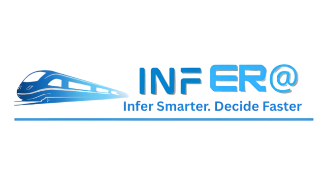

# 🚆 Infer@ – Smart Document Intelligence for KMRL (SIH 2025)

Infer@ is our **Smart India Hackathon 2025** project designed to streamline **document processing and information extraction** for **Kochi Metro Rail Limited (KMRL)**.  
Our solution leverages **AI-powered OCR, document understanding, and validation pipelines** to make unstructured data usable, reliable, and actionable.

---

## 📝 Problem Statement

**Problem Statement ID:** 25080  
**Title:** Document Overload at Kochi Metro Rail Limited (KMRL) – An Automated Solution  
**Organization:** Government of Kerala  
**Department:** Kochi Metro Rail Limited (KMRL)  
**Category:** Software  
**Theme:** Smart Automation  

### 📖 Description

Since its first commercial run in 2017, **KMRL** has grown into a complex, multidisciplinary enterprise that stretches far beyond train operations.  
Every business day the organization generates and receives **thousands of pages of material**:

- Engineering drawings  
- Maintenance job cards  
- Incident reports  
- Vendor invoices & purchase-order correspondence  
- Regulatory directives & safety circulars  
- HR policies, legal opinions, board-meeting minutes  
- Environmental-impact studies  

These documents arrive through **emails, Maximo exports, SharePoint repositories, WhatsApp PDFs, hard-copy scans, and cloud links**—often in **English, Malayalam, or hybrid bilingual formats**, frequently containing **tables, photos, and signatures**.  

This results in several challenges:

- ⏳ **Information latency** – Managers spend hours skimming lengthy documents for key insights, delaying critical decisions.  
- 🗂️ **Siloed awareness** – Departments work in isolation, missing crucial cross-team updates.  
- ⚖️ **Compliance exposure** – Regulatory updates risk being buried in inboxes, leading to missed deadlines or non-compliance.  
- 🧠 **Knowledge attrition** – Institutional memory is lost when staff transfer or retire.  
- 🔄 **Duplicated effort** – Teams redundantly create summaries and reports of the same documents, wasting time.  

As **KMRL expands** with new depots, corridors, and **emerging technologies** like UNS data streams and IoT monitoring, this document overload will only intensify.  
Without a smart, organization-wide mechanism, KMRL faces **slower decision cycles, higher costs, safety risks, and compliance vulnerabilities**.  

### 🎯 The Challenge

Equip every stakeholder—from **station controllers and engineers to finance officers and executive directors**—with **rapid, trustworthy snapshots of documents that matter to them**, while preserving traceability to the original source.  

**Impact:**  
- Faster cross-department coordination  
- Stronger regulatory compliance  
- Preservation of institutional knowledge  
- Improved service reliability  
- Safer and more passenger-centric metro operations  

---

## ✨ Key Features

- 📥 **Multi-Source Ingestion** – Supports emails, SharePoint, scanned PDFs, exports, and even WhatsApp links.  
- 🔎 **OCR + Layout Understanding** – Extracts structured data from complex documents with high accuracy.  
- ✍️ **Handwriting & Signature Detection** – Identifies handwritten notes and authenticates signatures.  
- 🧹 **Deduplication & Canonicalization** – Ensures clean, non-redundant, standardized data.  
- 👨‍💻 **Human-in-the-Loop Validation** – Combines AI automation with expert validation for reliability.  
- 🌐 **Hybrid Deployment** – Works both **on-premise and cloud**, ensuring flexibility and security.  
- 📊 **Monitoring & Analytics** – Integrated with **Grafana & Prometheus** for real-time performance tracking.  
- 💬 **Inbuilt Messaging** – Secure messaging integration (like WhatsApp) for quick collaboration.  
- 📧 **Smart Invitations** – Invite and manage team members easily through email integration.  

---

## 🛠️ Tech Stack

- **Frontend** → HTML,CSS,JS  
- **Backend** → Node.js, Express.js, Flask
- **AI/ML** → Python, OpenCV
- **OCR** → Tesseract, Google Document AI  
- **Messaging & APIs** → WebSockets, REST APIs  
- **Database** → MongoDB  
- **Deployment** → Docker + Kubernetes  
- **Monitoring** → Grafana, Prometheus  

---

## 📊 Competitive Edge

| Feature / Capability | UiPath | Google Document AI | ABBYY | **Infer@ (ours)** |
|-----------------------|--------|---------------------|-------|-------------------|
| Multi-Source Ingestion | ✅ | ✅ | ✅ | ✅ |
| OCR + Layout Extraction | ✅ | ✅ | ✅ | ✅ |
| Handwriting Detection | ✅ | ✅ | ✅ | ✅ |
| Signature Validation | ❌ | ✅ | ✅ | ✅ |
| Human-in-the-Loop | ❌ | ❌ | ❌ | ✅ |
| Hybrid Deployment | ❌ | Limited | ❌ | ✅ |

---

## 📂 Repository Structure
```
SIH25/
├── 📁 Credentials_Server/    # Secure storage of credentials
├── 📁 Frontend/              # React-based frontend
├── 📁 OCR_Backend/           # AI-powered OCR & extraction services
├── 📁 node_modules/          # Dependencies (ignored in GitHub)
├── 📄 start-local-network.bat
├── 📄 start-system.bat
├── 📄 package.json
└── 📄 README.md
```

---

## 📽️ Demo
🔗 [Click here to watch our solution video]([https://drive.google.com/file/d/1avSMbWBuqz7W4FwSi-brYzF4bMKDY1EO/view](https://youtu.be/Jba6Oc7b24s))

--- 

## 👨‍💻 Team

We are a group of passionate innovators collaborating under **Smart India Hackathon 2025** to build **Infer@**.

| Name               | Role(s) |
|--------------------|-----------------------------------------------------------|
| **Vrajkumar S. Parekh** | Team Leader • Full Stack Developer |
| **Yug N. Trivedi**      | Backend Developer • OCR Integration Engineer |
| **Vraj A. Parekh**      | Frontend Developer • UI/UX Designer |
| **Yug S. Patel**        | Frontend Developer • Visual Designer |
| **Utsav G. Patel**      | Content Strategist • Web App Designer • Video Editor |
| **Tia J. Patel**        | Data Collection • Resource Management |

---

## 🎯 Vision

<p align="center">
  
</p> 

> “Transforming how KMRL handles documents —  
> from **manual effort** to **AI-powered automation**.”

Our vision is to **reduce time, cost, and errors** in document workflows while ensuring **accuracy, compliance, and efficiency** at scale.
